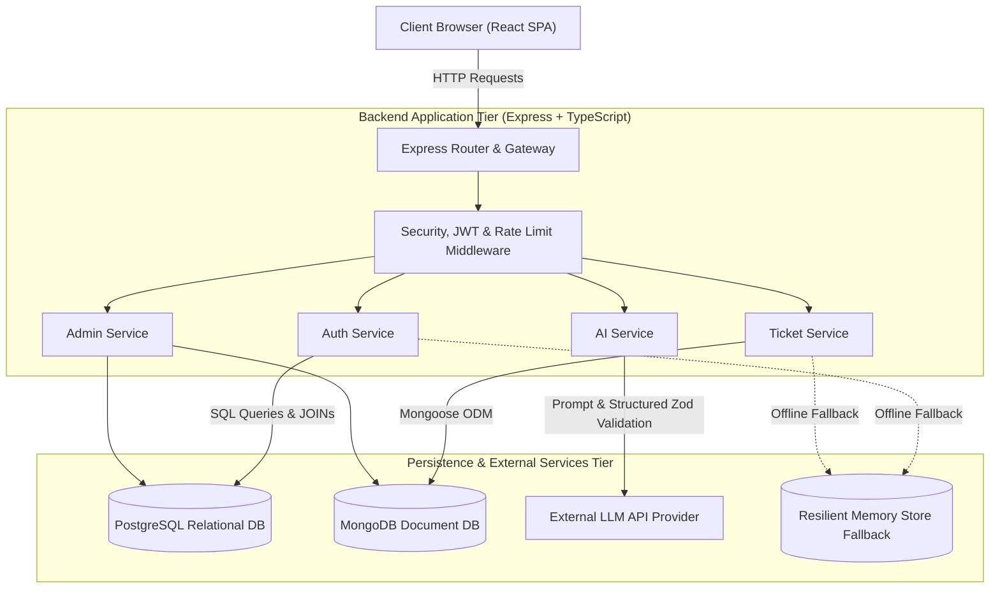

# High-Level Design (HLD)

# SupportDesk AI — System Architecture & Design

**Version:** 1.0  
**Status:** Approved / In Implementation  
**Document Owner:** SupportDesk AI Architecture Team  

---

## 1. System Overview

SupportDesk AI is an intelligent customer support application built on a multi-tier, decoupled architecture. The platform decouples presentation (React SPA), API routing & business logic (Express.js), relational entity management (PostgreSQL), high-volume document storage (MongoDB), and artificial intelligence services (LLM integration with structured validation).

```
+-------------------------------------------------------------+
|                     Client Tier                             |
|           React 19 + TypeScript + Vite + Tailwind           |
+-------------------------------------------------------------+
                              | HTTPS / JSON
                              v
+-------------------------------------------------------------+
|                     API Gateway / Backend                   |
|       Express.js Server (Port 5001) + Security Headers      |
|    - Auth Middleware (JWT)        - Rate Limiting           |
|    - Role-Based Access (RBAC)     - Zod Request Validator   |
+-------------------------------------------------------------+
          |                         |                     |
          v                         v                     v
+-------------------+     +------------------+  +-------------------+
|  Identity & RBAC  |     |  Ticket & Thread |  | AI Intelligence   |
|   (PostgreSQL)    |     |    (MongoDB)     |  |   (LLM API)       |
| Users, Orgs, Roles|     | Tickets, Messages|  | Structured Output |
+-------------------+     +------------------+  +-------------------+
```

---

## 2. High-Level Architecture Diagram



---

## 3. Subsystem Breakdown

### 3.1 Presentation Layer (Frontend Client)
* **Framework:** React 19, TypeScript, Vite, Tailwind CSS.
* **Routing:** `react-router-dom` with client-side route protection (`ProtectedRoute`) based on JWT authentication and role validation.
* **State Management:** React Context (`AuthContext`) managing global user credentials, session tokens, and instant persona switching for testing.
* **API Client:** Centralized Axios/Fetch wrapper (`api.ts`) with automated Bearer token injection and centralized error interceptors.

### 3.2 Application Layer (REST API & Business Logic)
* **Framework:** Node.js + Express.js in TypeScript with strict compilation.
* **Layered Architecture:** 
  * `Routes` — Mount endpoints and connect middleware.
  * `Controllers` — Validate input payloads, extract parameters, and format standardized JSON HTTP responses.
  * `Services` — Encapsulate business logic, database queries, and external API calls (controllers never query databases directly).
  * `Middleware` — Cross-cutting concerns: JWT authentication, RBAC role validation, body schema verification, and global error handling.

### 3.3 Data Persistence Tier
SupportDesk AI utilizes a **polyglot persistence** model to optimize for both relational rigor and document flexibility:
* **PostgreSQL (Structured Relational Layer):**
  * Manages strictly defined relational entities: `organizations`, `users`, `roles`, and `user_roles`.
  * Guarantees ACID compliance, foreign key referential integrity, and complex queries via SQL multi-table `JOIN`s.
* **MongoDB (Semi-Structured Document Layer):**
  * Stores flexible, evolving records: `tickets`, `messages`, and `conversations`.
  * Supports high-throughput message writes, embedded timeline events, and polymorphic message content.
* **Resilient Memory Store Adapter:**
  * Implements an in-memory replica of database operations pre-seeded with demo accounts (`customer@supportdesk.ai`, `agent@supportdesk.ai`, `admin@supportdesk.ai`), allowing seamless development and evaluation even without external database daemons running.

### 3.4 AI Intelligence Layer
* **LLM Engine:** Encapsulates prompt templates for categorization, sentiment analysis, agent reply drafting, and support conversations.
* **Output Validation Guardrails:** AI responses are parsed through Zod schemas before application logic receives them. Invalid formats trigger automatic fallback parsing rather than application crashes.
* **Prompt Injection Defense:** System instructions are isolated from untrusted user ticket descriptions.

---

## 4. Key Data Flows

### 4.1 Authentication & Session Flow
```
User (Browser)               Express Gateway            PostgreSQL DB
      |                            |                          |
      |-- 1. POST /auth/login ---->|                          |
      |                            |-- 2. Query User & Role ->|
      |                            |<-- 3. Return Hash & Role-|
      |                            |                          |
      |                            |-- 4. bcrypt.compare()    |
      |                            |-- 5. Sign JWT (HS256)    |
      |<-- 6. { token, user } -----|                          |
      |                            |                          |
      |-- 7. GET /tickets + JWT -->|                          |
      |    (Bearer Token)          |-- 8. Verify Token & Role |
```

### 4.2 Ticket Creation with AI Auto-Classification
```
Customer                     Ticket Service               AI Service / LLM          MongoDB
   |                               |                              |                    |
   |-- 1. POST /api/tickets ------>|                              |                    |
   |    { title, description }     |-- 2. Prompt LLM ------------>|                    |
   |                               |    (title + description)     |                    |
   |                               |<-- 3. Structured JSON -------|                    |
   |                               |    (intent, priority, etc.)  |                    |
   |                               |                              |                    |
   |                               |-- 4. Validate with Zod       |                    |
   |                               |-- 5. Save Ticket + AI tags ---------------------->|
   |<-- 6. Return Created Ticket --|                                                   |
```

---

## 5. Technology Stack & Rationale

| Layer | Technology | Decision Rationale |
| :--- | :--- | :--- |
| **Frontend** | React 19 + TypeScript | High rendering performance, strong type safety, and modern component model. |
| **Styling** | Tailwind CSS | Rapid, consistent design system implementation with minimal CSS bundle footprint. |
| **Backend** | Node.js + Express.js | High concurrency I/O, rich ecosystem, and seamless TypeScript compatibility. |
| **Relational DB** | PostgreSQL | Proven ACID reliability, foreign-key data integrity for identity and role management. |
| **Document DB** | MongoDB | Document flexibility for rapidly changing ticket schemas, message threads, and conversation logs. |
| **AI Integration** | LLM API + Zod | Modern prompt engineering with guaranteed runtime structural schema enforcement. |

---

## 6. Security Architecture

1. **Authentication:** Stateless JSON Web Tokens (JWT) signed with HMAC-SHA256 and server-side secret keys.
2. **Password Storage:** Irreversible password hashing using `bcrypt` with work factor 10.
3. **Role Enforcement (RBAC):** Modular route middleware (`requireRole('Agent', 'Admin')`) ensuring users access only authorized endpoints.
4. **Input Sanitization:** All request payloads are validated via Zod schemas, stripping unapproved fields and preventing SQL/NoSQL injection.
5. **Rate Limiting:** Express rate limiting middleware applied to authentication and AI routes to prevent brute-force attacks and token exhaustion.
6. **Secret Management:** Server secrets (JWT secret, DB connections, API keys) strictly loaded via `.env` environment files and ignored from version control.

---

## 7. Deployment & Scalability

* **Containerization:** Pre-configured `docker-compose.yml` defining PostgreSQL, MongoDB, Backend, and Frontend containers.
* **Stateless API Design:** Express services do not store session state in memory; any server instance can handle incoming requests when scaled horizontally behind a reverse proxy (e.g., NGINX, Cloudflare).
* **Database Connection Pooling:** PostgreSQL connection pooling (`pg.Pool`) and Mongoose connection reuse maximize database throughput.
